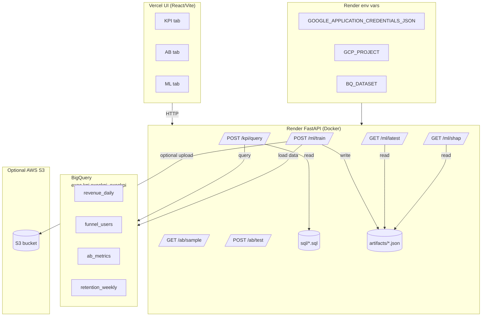

# ExecKPI
[](https://github.com/mdgolammafuz/exec-kpi/actions/workflows/backend-ci.yml)
---

## 1. Overview

ExecKPI is an analytics application that connects:

- a React/Vite UI (Vercel),
- a FastAPI backend (Render, Docker),
- Google BigQuery as the warehouse.

It supports KPI queries, A/B testing stats (SRM p-value, 2-prop z p-value, 95% CI), and an ML train step that pulls data from BigQuery and writes artifacts.  
**Dataset used:** KPI views are in `exec-kpi.execkpi_execkpi` (project: `exec-kpi`, dataset: `execkpi_execkpi`). These views are derived from Google's public ecommerce dataset `bigquery-public-data.thelook_ecommerce` (staged into our own dataset and then reshaped into revenue, funnel, A/B, and retention views).

---

## 2. Live endpoints


- **Backend (Render):**
    - API (FastAPI/Swagger): https://execkpi-backend-latest.onrender.com/docs
    - Raw root/health: https://execkpi-backend-latest.onrender.com/
- **UI (Vercel):** https://execkpi-ui-vercel.vercel.app/  
- **UI repo (Vercel host):** https://github.com/mdgolammafuz/execkpi-ui-vercel.git

We keep a working copy of the UI inside this main repo (`execkpi-ui/`), and we also keep a separate UI repo for Vercel so deployments stay clean and fast.

---

## 3. Architecture



**Data flow**

1. UI → `POST /kpi/query` → backend reads `sql/api_*.sql` → BigQuery (`exec-kpi.execkpi_execkpi`) → returns JSON.
2. UI → `GET /ab/sample` / `POST /ab/test` → backend computes SRM p-value, p-value, 95% CI → returns JSON.
3. UI → `POST /ml/train` → backend runs `backend/train_explain.py` → BigQuery → writes to `artifacts/` → UI can call `/ml/latest` and `/ml/shap`.

---

## 4. Environments and configuration

**Local**

```bash
pip install -r requirements.txt
uvicorn backend.main:app --reload --port 8001
```

Local can authenticate to BigQuery via:

- `gcloud auth application-default login`, **or**
- `export GOOGLE_APPLICATION_CREDENTIALS_JSON=<base64-service-account-json>`

**Render (backend)**

- built from `Dockerfile.backend`
- environment:
  - `GCP_PROJECT=exec-kpi`
  - `BQ_DATASET=execkpi_execkpi`
  - `GOOGLE_APPLICATION_CREDENTIALS_JSON=<base64-service-account>`
  - optional: `EXECKPI_S3_BUCKET=<bucket>` to mirror artifacts to S3
- public URL: https://execkpi-backend-latest.onrender.com/docs

**Vercel (UI)**

- repo: https://github.com/mdgolammafuz/execkpi-ui-vercel.git
- env:
  - `VITE_API_BASE=https://execkpi-backend-latest.onrender.com`

---

## 5. Commands

**Run backend (local)**

```bash
uvicorn backend.main:app --reload --port 8001
```

**One-command Docker run (example)**

```bash
docker run -p 8080:8080   -e GCP_PROJECT=exec-kpi   -e BQ_DATASET=execkpi_execkpi   -e GOOGLE_APPLICATION_CREDENTIALS_JSON='<base64-service-account>'   mdgolammafuz/execkpi-backend:latest
```

Then visit: `http://127.0.0.1:8080/docs`

**Local CI (same steps as GitHub Actions)**

```bash
ruff check backend
black --check backend
pytest
```

**Trigger ML train (live backend)**

```bash
curl -X POST https://execkpi-backend-latest.onrender.com/ml/train
```

---

## 6. API → asset mapping

- `POST /kpi/query` → uses SQL in `sql/api_*.sql`
- `GET /ab/sample` → returns demo sample from backend
- `POST /ab/test` → Python computation: SRM p-value, 2-prop z p-value, 95% CI, significance flag
- `POST /ml/train` → runs `backend/train_explain.py`
- `GET /ml/latest` → reads `artifacts/metrics.json`
- `GET /ml/shap` → reads `artifacts/shap_summary.json` (404 if not present)

Dataset behind these KPI queries is: **BigQuery dataset `execkpi_execkpi` in project `exec-kpi`.**

---

## 7. Folder structure

**Main repo (`exec-kpi`)**

```text
.
├── Dockerfile.backend
├── README.md
├── airflow/               # local airflow / orchestration
├── artifacts/             # ML outputs written by trainer
├── backend/               # FastAPI + trainer
│   ├── __init__.py
│   ├── main.py
│   └── train_explain.py
├── dbt_project/           # dbt models, target, logs
├── docs/
├── execkpi-ui/            # UI copy kept in the main repo
├── infra/                 # aws/ and gcp/ (terraform / k8s / helm stubs)
├── logs/
├── pyproject.toml         # ruff/black/pytest config
├── pytest.ini
├── requirements.txt
├── sql/                   # KPI SQLs and supporting views
└── tests/                 # pytest tests (health, config, imports)
```

**UI folder (copy inside repo: `execkpi-ui/`)**

```text
execkpi-ui/
├── README.md
├── index.html
├── public/
├── src/
│   ├── App.tsx
│   ├── api.ts
│   ├── index.css
│   └── main.tsx
├── package.json
├── package-lock.json
└── vite.config.ts
```

**Separate UI repo for Vercel**

- https://github.com/mdgolammafuz/execkpi-ui-vercel.git
- mirrors the above UI but without the rest of the monorepo, so Vercel builds stay small and focused.

---

## 8. AWS S3 / GCP / infra

- The trainer supports an optional `EXECKPI_S3_BUCKET` environment variable. When present, artifacts written to `artifacts/` can also be mirrored to S3. This shows integration with AWS storage.
- The `infra/aws` and `infra/gcp` folders are present to show that the same service can be provisioned through cloud/terraform or k8s/helm style configs.
- BigQuery access is done through an environment-supplied, base64-encoded service account JSON, decoded at runtime. This keeps secrets out of the image and still lets the container run on Render.

---

## 9. Trade-offs and considerations

- **Stateful ML step:** artifacts are written to container storage; this is intentional to show a stateful component. For long-running deployments they should be pushed to S3/GCS.
- **Open CORS:** allowed so that the Vercel UI and local browsers can call the Render backend directly. In production this can be tightened to specific origins.
- **SQL in repo:** keeping KPI SQL under `sql/` makes the pipeline reviewable and keeps business logic under version control.
- **Two UI locations:** keeping a copy in the main repo proves end-to-end integration; keeping a separate repo for Vercel keeps deployments clean.

---

## 10. CI

GitHub Actions:  
[](https://github.com/mdgolammafuz/exec-kpi/actions/workflows/backend-ci.yml)

Runs on push:

1. `ruff check backend`
2. `black --check backend`
3. `pytest`

---

## 11. Data Protection / GDPR Notes

- This project uses analytical data derived from Google BigQuery public sample data (`bigquery-public-data.thelook_ecommerce`) and reshapes it into reporting views in `exec-kpi.execkpi_execkpi`. No real customer PII is expected in this setup.
- The repository does **not** contain production secrets or credentials. Service account credentials are passed to the backend at runtime via environment variables (e.g. `GOOGLE_APPLICATION_CREDENTIALS_JSON`) on the hosting platform.
- If this project is connected to non-public or customer data, the data controller is responsible for:
  - providing a lawful basis for processing,
  - ensuring data minimisation in the warehouse views,
  - configuring access control on the GCP project and BigQuery datasets,
  - and rotating / protecting service account keys.
- Application logs in the current setup are technical (requests, errors) and should not include personal data. If personal data is later added to the pipelines, log redaction and retention policies must be aligned with the organisation’s GDPR policy.
- Frontend ↔ backend traffic is over HTTPS (Vercel → Render), but when deploying to another environment, TLS must be enforced to avoid transmitting identifiers in cleartext.

---

## 12. License

This project is licensed under the **MIT License**.

```text
MIT License

Copyright (c) 2025

Permission is hereby granted, free of charge, to any person obtaining a copy
of this software and associated documentation files (the "Software"), to deal
in the Software without restriction, including without limitation the rights
to use, copy, modify, merge, publish, distribute, sublicense, and/or sell
copies of the Software, and to permit persons to whom the Software is
furnished to do so, subject to the following conditions:

The above copyright notice and this permission notice shall be included in all
copies or substantial portions of the Software.

THE SOFTWARE IS PROVIDED "AS IS", WITHOUT WARRANTY OF ANY KIND, EXPRESS OR
IMPLIED, INCLUDING BUT NOT LIMITED TO THE WARRANTIES OF MERCHANTABILITY,
FITNESS FOR A PARTICULAR PURPOSE AND NONINFRINGEMENT. IN NO EVENT SHALL THE
AUTHORS OR COPYRIGHT HOLDERS BE LIABLE FOR ANY CLAIM, DAMAGES OR OTHER
LIABILITY, WHETHER IN AN ACTION OF CONTRACT, TORT OR OTHERWISE, ARISING FROM,
OUT OF OR IN CONNECTION WITH THE SOFTWARE OR THE USE OR OTHER DEALINGS IN THE
SOFTWARE.
```

---