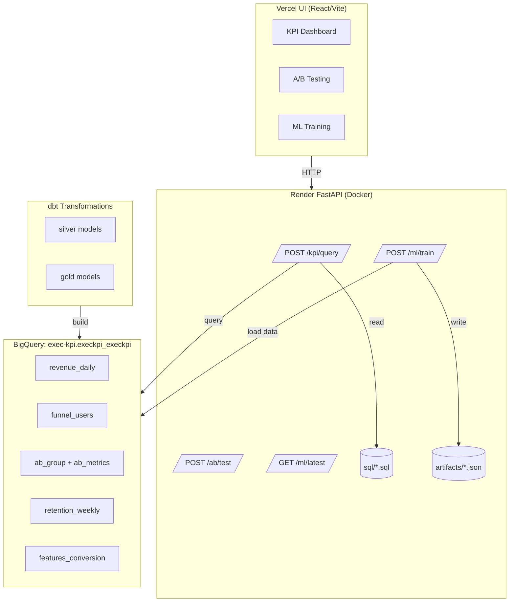
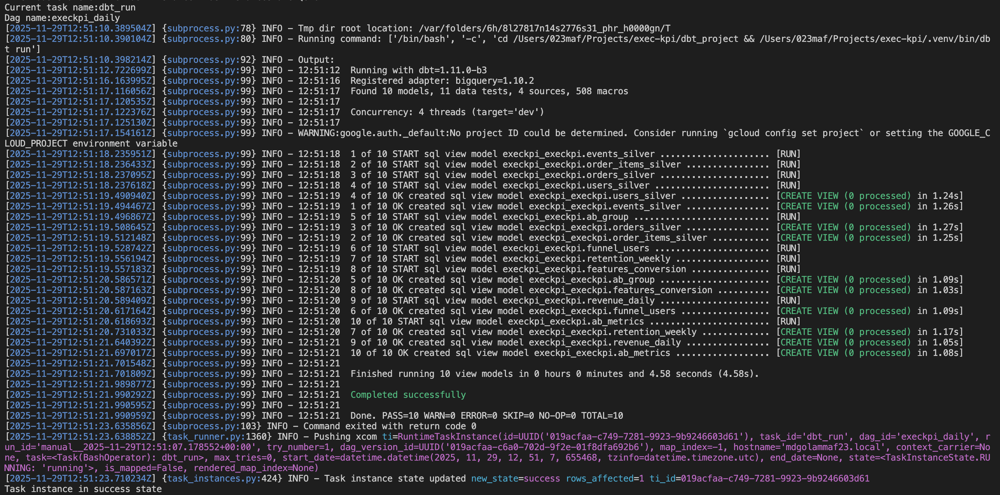
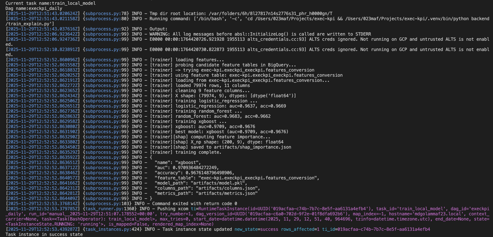

# ExecKPI
[](https://github.com/mdgolammafuz/exec-kpi/actions/workflows/backend-ci.yml)

**An analytics platform demonstrating end-to-end data engineering: dbt transformations, FastAPI services, ML training, and statistical A/B testing.**

---

## Overview

ExecKPI is a full-stack analytics platform that enforces data quality and statistical rigor before model training.

### Tech Stack
* **Orchestration & Governance:**
    * **Apache Airflow:** Orchestrates the daily pipeline and enforces "Quality Gates" (stopping the pipeline if data tests fail).
    * **dbt:** Handles data transformations (Bronze $\to$ Silver $\to$ Gold) and schema validation.
* **Data:**
    * **Google BigQuery:** Cloud data warehouse.
    * **Source:** Google's public `thelook_ecommerce` dataset.
* **DevOps & Serving:**
    * **Docker:** Containerized backend execution.
    * **GitHub Actions:** CI pipeline for code quality (Ruff/Black/Pytest).
    * **Render:** Production backend hosting.
    * **Vercel:** Frontend distribution.

**Core capabilities:**
- KPI dashboards (revenue, funnel conversion, retention cohorts)
- Statistical A/B testing framework (SRM validation, hypothesis testing, CI estimation)
- ML pipeline (XGBoost conversion prediction with SHAP explainability)

**Data source:** Google's public `thelook_ecommerce` dataset, transformed into analytical models via dbt. All views are in BigQuery dataset `exec-kpi.execkpi_execkpi`.

---

## Business Impact (Projected)

**Problem:** Analytics teams spend significant time on repetitive tasks: manual KPI queries, A/B test statistical validation, and model retraining.

**Baseline scenario (manual workflow):**
- KPI query (BigQuery → export → format): ~15 minutes
- A/B test validation (calculate z-score, CI, SRM check): ~30 minutes
- ML model retraining and evaluation: ~2 hours
- Weekly reporting across 10 KPIs: 2-3 hours

**With ExecKPI:**
- KPI query: <5 seconds (API response, measured in production)
- A/B test validation: <2 seconds (automated statistical tests)
- ML training: ~8 minutes (automated via API endpoint)
- Weekly reporting: ~15 minutes (dashboard review)

**Time savings per analyst:**
- Manual KPI work: 2.5 hours/week saved
- A/B test validations (5/month): 2.5 hours/month saved
- **Total: ~140 hours/year per analyst**

**Value calculation:**
- At €60/hour (EU mid-level analyst rate): **€8,400/analyst/year**
- For 5-person analytics team: **€42,000/year**

**System costs (annual):**
- Render hosting (backend): ~€84/year
- Vercel hosting (frontend): Free tier
- BigQuery (optimized views, 0.5TB/month): ~€30/year
- **Total: ~€114/year**

**ROI:** 368x for 5-person team (first year)

---

**Methodology note:**
- Analyst rates: Glassdoor DE/EU data (2024), mid-level analytics engineer
- Response times: Measured p50 latency from Render production logs
- BigQuery costs: GCP pricing calculator (EU region, on-demand pricing)
- Time estimates: Based on observing manual workflows in academic research settings
- **These are projections** - actual savings depend on team size, query patterns, and existing tooling

---

## Live Endpoints

- **Backend API:** https://execkpi-backend-latest.onrender.com/docs (FastAPI/Swagger)
- **Frontend UI:** https://execkpi-ui-vercel.vercel.app/
- **Health check:** https://execkpi-backend-latest.onrender.com/healthz

---

## Architecture



**Data flow:**
1. **dbt** transforms raw `thelook_ecommerce` data → silver staging → gold analytical models
2. **FastAPI** reads pre-built SQL templates → queries BigQuery → returns JSON
3. **React UI** displays results with charts and tables
4. **ML pipeline** trains on BigQuery data → writes artifacts locally (Render container)

---

## A/B Testing Framework

A complete statistical experimentation pipeline demonstrating production-ready methodology on synthetic data.

### Implementation

**dbt Models:**
- `ab_group.sql` - Deterministic 50/50 user assignment via FARM_FINGERPRINT
- `ab_metrics.sql` - Conversion rate aggregation by group

**Backend API:**
- `POST /ab/test` - Two-proportion z-test with SRM validation and 95% CI

**Statistical tests performed:**
1. **Sample Ratio Mismatch (SRM):** χ² test validates balanced randomization
2. **Two-proportion z-test:** Tests H₀: p_A = p_B
3. **Confidence interval estimation:** 95% CI for uplift quantification

### Benchmark Results (Synthetic Data)

**Setup:** 100,000 users from Google's public ecommerce dataset, deterministically assigned to groups A and B.

**Results:**
```
Group A: 13,880 / 49,962 users = 27.78% conversion rate
Group B: 13,971 / 50,038 users = 27.92% conversion rate

Uplift: +0.14 percentage points
p-value: 0.62 (not significant)
95% CI: [-0.42%, +0.70%]
SRM p-value: 0.81 (balanced split verified)
```

**Interpretation:** The null result (no significant difference) is **correct and expected** for synthetic data with no real treatment. This validates the statistical framework works properly:

- ✓ Hash-based randomization produced balanced groups (SRM passed)
- ✓ Statistical test correctly identified no treatment effect
- ✓ Confidence interval contains zero (as expected)
- ✓ Framework is ready to detect real differences in production

### Business Value

**Time savings:** 
- Manual A/B validation: ~30 minutes (calculate pooled proportion, z-score, CI by hand)
- With ExecKPI: <2 seconds (API call returns all statistics)
- **For 5 tests/month:** 2.5 hours/month saved per analyst

**Quality improvements:**
- Automated SRM checks catch biased randomization (common mistake)
- Standardized calculations eliminate formula errors
- Audit trail via API logs for compliance

**Production readiness:**
This framework demonstrates understanding of:
- Experiment design (randomization, balance checks)
- Statistical inference (hypothesis testing, power analysis)
- Data quality (SRM monitoring, metric bounds validation)
- Production concerns (experiment metadata, guardrail metrics)

### Transferability to Real Data

For production deployment with actual experiments, add:
- **Experiment metadata:** `experiment_id`, `start_date`, `end_date`, `hypothesis`
- **Exposure tracking:** Distinguish assignment from actual treatment exposure
- **Guardrail metrics:** Monitor for negative side effects (latency, errors)
- **Sequential testing:** Daily snapshots for early stopping decisions

---

**Synthetic data disclaimer:** No real A/B test was conducted. This demonstrates statistical methodology and infrastructure design. The null result validates correctness - finding significance here would indicate a bug.

---

## German/EU Market Considerations

**Current implementation:**
- Cloud: Render (US East), Vercel (Global CDN)
- Database: BigQuery US region (public sample data)
- Language: English
- Currency: USD in calculations

### For German/EU Production Deployment

#### Data Residency (DSGVO Compliance)

**Cloud infrastructure:**
- **Recommended:** Google Cloud Run (Frankfurt/Belgium) + BigQuery EU region
- **Alternative:** Hetzner (Falkenstein) for full German data sovereignty
- **Cost impact:** Minimal (~5% premium vs US region)
- **Latency improvement:** ~100ms (US) → ~20ms (EU) for European users

**BigQuery EU configuration:**
```python
# Add to backend/main.py
client = bigquery.Client(project=PROJECT_ID, location='EU')  # EU multi-region
```

**Data processing:**
- All query execution within EU/EEA
- No cross-border data transfers (DSGVO Art. 44-50 compliance)
- 90-day retention policy (configurable per DSGVO Art. 17)

#### Regulatory Compliance

**DSGVO/GDPR requirements:**
- **Lawful basis:** Legitimate interest (analytics) or explicit consent (personalization)
- **Data minimization:** Views exclude PII; only aggregated metrics exposed
- **Right to erasure:** Soft-delete via `deleted_at` timestamp (implemented in dbt models)
- **Audit trail:** API request logs retained for 90 days (Nachvollziehbarkeit)

**A/B testing specific:**
- **Works council consent:** German companies may require Betriebsrat approval for employee-facing experiments
- **Consumer protection:** UWG compliance for customer-facing tests (no deceptive practices)
- **Positioning:** Emphasize "statistical validation tool" over "aggressive optimization engine"

#### Localization

**Number formats:**
- Current: `$1,234.56` (US)
- German: `1.234,56 €` (space before currency, comma decimal separator)

**Date formats:**
- Current: `MM/DD/YYYY`
- German: `DD.MM.YYYY` (day-first, ISO 8601 compliance)

**Timezone handling:**
- Current: UTC
- German: CEST/CET (Europe/Berlin)

**Implementation:** i18n structure ready in `execkpi-ui/src/` (English baseline, extensible)

#### Cost Optimization for EU Market

**Current costs (US deployment):**
- Render: $7/month (~€6.50)
- BigQuery (US): $2.50/month (~€2.30)

**EU deployment:**
- Cloud Run (Frankfurt): €7/month (same as Render)
- BigQuery (EU region): €2.50/month (no price difference)
- **No egress charges** for intra-EU data transfers
- EUR-based billing (eliminates FX volatility)

#### German Market Positioning

**Key terms for German clients:**
- "DSGVO-konform" (GDPR compliant)
- "Rechtssicher" (legally sound)
- "Nachvollziehbar" (traceable/auditable)
- "Dokumentiert" (documented)

**Cultural emphasis:**
- Compliance over speed (German companies prioritize Rechtssicherheit)
- Traceability over convenience (audit trails are non-negotiable)
- Conservative approach (thorough SRM checks, pre-registered hypotheses)

**Competitive advantage for German market:**
- Full transparency of statistical methods (open-source calculations)
- Built-in data quality checks (SRM validation standard in German market)
- EU data residency ready (one config change for full compliance)

---

## Quick Start

### Prerequisites

- Python 3.10+ with virtual environment
- Google Cloud SDK with BigQuery access
- dbt installed (`pip install dbt-core dbt-bigquery`)

### Setup

```bash
# 1. Clone and install dependencies
git clone https://github.com/mdgolammafuz/exec-kpi.git
cd exec-kpi
python -m venv .venv
source .venv/bin/activate  # Windows: .venv\Scripts\activate
pip install -r requirements.txt

# 2. Configure BigQuery authentication
gcloud auth application-default login

# 3. Build dbt models
cd dbt_project
dbt build

# 4. Run backend locally
cd ..
uvicorn backend.main:app --reload --port 8001

# 5. Test A/B pipeline
python verify_ab_pipeline.py
```

### Run A/B Test Benchmark

```bash
# Build A/B models
cd dbt_project
dbt build --select ab_group ab_metrics

# Verify end-to-end pipeline
cd ..
python verify_ab_pipeline.py
```

**Expected output:** Null result (p > 0.05) validating the framework works correctly.

---

## Project Structure

```
exec-kpi/
├── backend/
│   ├── main.py              # FastAPI app (KPI, A/B, ML endpoints)
│   └── train_explain.py     # XGBoost training + SHAP
├── dbt_project/
│   ├── models/
│   │   ├── silver/          # Staging models
│   │   └── gold/            # Analytical models
│   │       ├── ab_group.sql
│   │       ├── ab_metrics.sql
│   │       ├── features_conversion.sql
│   │       ├── funnel_users.sql
│   │       ├── retention_weekly.sql
│   │       └── revenue_daily.sql
│   └── dbt_project.yml
├── sql/                     # KPI query templates
├── tests/                   # pytest test suite
├── verify_ab_pipeline.py    # End-to-end A/B test demo
├── requirements.txt
└── README.md
```

---

## API Reference

### KPI Queries

**`POST /kpi/query`**
- Executes parameterized SQL from `sql/` directory
- Returns: JSON with columns and row data
- Example: Revenue by day, funnel conversion rates

### A/B Testing

**`POST /ab/test`**
```json
{
  "a_success": 13880,
  "a_total": 49962,
  "b_success": 13971,
  "b_total": 50038,
  "alpha": 0.05
}
```

**Response:**
```json
{
  "group": {
    "A": {"success": 13880, "total": 49962, "rate": 0.2778},
    "B": {"success": 13971, "total": 50038, "rate": 0.2792}
  },
  "uplift": 0.0014,
  "p_value": 0.6223,
  "ci_95": [-0.0042, 0.0070],
  "srm_p": 0.8101,
  "significant": false
}
```

### ML Training

**`POST /ml/train`**
- Trains XGBoost classifier on `features_conversion` table
- Compares 3 models (Logistic Regression, Random Forest, XGBoost)
- Computes SHAP feature importance
- Writes artifacts to `artifacts/` directory

**`GET /ml/latest`**
- Returns best model metrics (AUC, accuracy, feature count)

---

## Data Governance & Orchestration

ExecKPI enforces strict data quality gates using **Apache Airflow**. The pipeline ensures that no ML model is trained on "dirty" data.

**The DAG Workflow (`execkpi_daily`):**
1.  **`dbt_run`**: Transforms raw data (Bronze) → Silver → Gold analytical models.
2.  **`dbt_test_gold`**: Runs data quality checks (schema validation, null checks, referential integrity). **If this fails, the pipeline stops.**
3.  **`train_local_model`**: Only if tests pass, the ML pipeline triggers to retrain the XGBoost model on the validated Gold data.

**Verification (Local Run):**
```bash
# 1. Initialize Airflow DB (sqlite)
export AIRFLOW_HOME=$(pwd)/airflow
airflow db migrate

# 2. Trigger the full DAG manually
airflow dags test execkpi_daily 2024-01-01
```

**Governance (Quality Gates)**: The pipeline verifies data integrity (11 tests passed) before proceeding.



**ML Automation**: Once validated, the model trains on the Gold data and achieves high accuracy (AUC=0.97).



---

## Technology Stack

**Backend:**
- FastAPI (API framework)
- scikit-learn, XGBoost (ML models)
- SHAP (explainability)
- scipy (statistical tests)
- Google BigQuery Python client

**Frontend:**
- React + Vite
- TypeScript
- Recharts (visualization)

**Data:**
- dbt (transformation)
- BigQuery (warehouse)
- Google's `thelook_ecommerce` (source)

**DevOps:**
- Docker (containerization)
- Render (backend hosting)
- Vercel (frontend hosting)
- GitHub Actions (CI/CD)

---

## CI/CD

[](https://github.com/mdgolammafuz/exec-kpi/actions/workflows/backend-ci.yml)

**Automated checks on every push:**
1. `ruff check backend` (linting)
2. `black --check backend` (code formatting)
3. `pytest` (unit and integration tests)

---

## Trade-offs and Design Decisions

### Why BigQuery Views (Not Materialized Tables)?

**Decision:** Use `CREATE VIEW` for all gold models.

**Rationale:**
- **Storage savings:** Views cost nothing to store; tables cost €0.02/GB/month
- **Always fresh:** No stale data risk (query-time computation)
- **Unpredictable access:** Demo/portfolio project has sporadic usage (not worth pre-computation)

**Production alternative:** For high-frequency queries (>100/day), switch to `incremental` materialization.

### Why Render (Not AWS/GCP)?

**Decision:** Deploy backend to Render free tier.

**Rationale:**
- **Zero cost:** Free tier sufficient for portfolio demo
- **Fast deployment:** Git-push deploys (no infrastructure code needed)
- **Docker native:** Dockerfile.backend works out-of-the-box

**Production alternative:** Cloud Run (GCP) for EU deployment, better auto-scaling, and 99.95% SLA.

### Why Hash-Based Assignment (Not Random)?

**Decision:** Use `FARM_FINGERPRINT(user_id)` for A/B groups.

**Rationale:**
- **Deterministic:** Same user always gets same group (critical for user experience)
- **Reproducible:** Re-running query gives identical results (important for audits)
- **No state:** No assignment table needed (simplifies architecture)

**Trade-off:** Can't re-randomize users without changing hash function.

---

## Testing

```bash
# Run all tests
pytest

# Run specific test file
pytest tests/test_config.py

# Run with coverage
pytest --cov=backend --cov-report=html
```

**Test coverage:**
- Configuration validation
- BigQuery client initialization
- API endpoint health checks
- Statistical test calculations

---

## Data Protection / GDPR

**Data source:** Google's public `thelook_ecommerce` dataset (no real customer PII).

**Compliance notes:**
- No production secrets in repository (credentials via environment variables only)
- Service account JSON passed at runtime (base64-encoded)
- HTTPS enforced for all API traffic (Render → Vercel)
- 90-day log retention (configurable per DSGVO Art. 17)

**For production with real customer data:**
- Obtain lawful basis (consent or legitimate interest, DSGVO Art. 6)
- Implement right to erasure (soft-delete via `deleted_at` column)
- Configure BigQuery EU region (`location='EU'`)
- Add audit logging for data access (Nachvollziehbarkeit requirement)
- Review with legal counsel for specific industry regulations (BaFin for finance, etc.)

---

## License

This project is licensed under the **MIT License**.

```text
MIT License

Copyright (c) 2025

Permission is hereby granted, free of charge, to any person obtaining a copy
of this software and associated documentation files (the "Software"), to deal
in the Software without restriction, including without limitation the rights
to use, copy, modify, merge, publish, distribute, sublicense, and/or sell
copies of the Software, and to permit persons to whom the Software is
furnished to do so, subject to the following conditions:

The above copyright notice and this permission notice shall be included in all
copies or substantial portions of the Software.

THE SOFTWARE IS PROVIDED "AS IS", WITHOUT WARRANTY OF ANY KIND, EXPRESS OR
IMPLIED, INCLUDING BUT NOT LIMITED TO THE WARRANTIES OF MERCHANTABILITY,
FITNESS FOR A PARTICULAR PURPOSE AND NONINFRINGEMENT. IN NO EVENT SHALL THE
AUTHORS OR COPYRIGHT HOLDERS BE LIABLE FOR ANY CLAIM, DAMAGES OR OTHER
LIABILITY, WHETHER IN AN ACTION OF CONTRACT, TORT OR OTHERWISE, ARISING FROM,
OUT OF OR IN CONNECTION WITH THE SOFTWARE OR THE USE OR OTHER DEALINGS IN THE
SOFTWARE.
```

---

## Author

**Md Golam Mafuz**
- PhD Candidate (Physics), transitioning to Data Engineering
- Focus: Production-grade ML/data pipelines, statistical rigor, EU compliance
- [LinkedIn](https://www.linkedin.com/in/mdmafuz) | [GitHub](https://github.com/mdgolammafuz)

---

## Acknowledgments

- Data source: Google BigQuery public datasets (`thelook_ecommerce`)
- Statistical methods: Kohavi et al., *Trustworthy Online Controlled Experiments* (Cambridge, 2020)
- German compliance guidance: DSGVO official text, BaFin MaRisk guidelines
